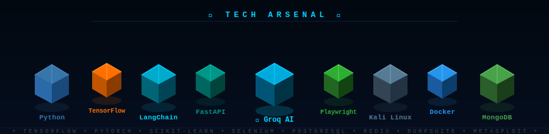
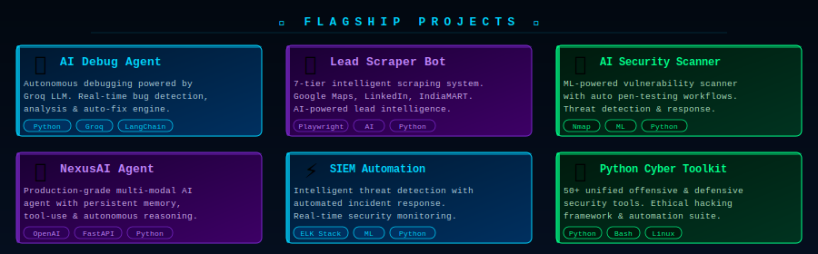

<!-- ████████████████████████████████████████████████████████████████ -->
<!-- ██                                                            ██ -->
<!-- ██         ROHIT CHOUDHARY — GITHUB PROFILE README           ██ -->
<!-- ██         Built with custom 3D SVG assets                   ██ -->
<!-- ████████████████████████████████████████████████████████████████ -->

<div align="center">

<!-- ╔══════════════════════════════════════════╗ -->
<!-- ║        FULLY 3D ANIMATED HEADER         ║ -->
<!-- ╚══════════════════════════════════════════╝ -->


<br/>

<!-- LIVE BADGES -->

&nbsp;

&nbsp;

&nbsp;


<br/><br/>

<!-- SOCIAL LINKS -->
<a href="https://linkedin.com/in/rohit-choudharyPortfolio">
  
</a>
&nbsp;
<a href="https://24.ub.com/Rohi56u">
  
</a>
&nbsp;
<a href="mailto:rohit@example.com">
  
</a>

</div>

---

## 🧠 The Mind Behind the Machine

```python
class RohitChoudhary:
    def __init__(self):
        self.name        = "Rohit Choudhary"
        self.username    = "@Rohi56u"
        self.location    = "Gurgaon, Haryana 🇮🇳"
        self.roles       = [
            "🤖 AI Engineer",
            "🛡️ Cybersecurity Developer",
            "🐍 Python Automation Specialist"
        ]
        self.projects    = "150+ Live Repositories 🚀"
        self.mission     = "Build systems that think, protect and automate"
        self.stack       = ["Python", "TensorFlow", "LangChain", "Groq", "Kali Linux"]
        self.currently   = ["Agentic AI Systems", "Red Team Automation", "ML Security"]
        self.fun_fact    = "I automate my sleep schedule too... just kidding 😄"

    def say_hi(self):
        print("Hey! Thanks for dropping by 👋")
        print("Let's build something legendary together 💡")

me = RohitChoudhary()
me.say_hi()
```

<div align="center">

| 🎯 Expertise | 🔭 Building Now | 🤝 Available For |
|:---:|:---:|:---:|
| AI + Cybersecurity Intersection | Autonomous AI Security Agents | Open-Source Projects |
| Large-Scale Python Automation | ML-Powered Threat Detection | Freelance Automation |
| Generative AI Applications | Intelligent Scraping Frameworks | Research Partnerships |

</div>

---

## ⚡ 3D Tech Arsenal

<div align="center">

<!-- FULLY 3D ISOMETRIC TECH CUBES — SELF HOSTED SVG -->


</div>

---

## 🚀 Flagship Projects

<div align="center">

<!-- FULLY 3D GLOWING PROJECT CARDS — SELF HOSTED SVG -->


</div>

---

## 📊 GitHub Analytics

<div align="center">


&nbsp;


</div>

---

## 🐍 Contribution Snake

<div align="center">

<picture>
  <source media="(prefers-color-scheme: dark)"  srcset="https://raw.githubusercontent.com/Rohi56u/Rohi56u/output/github-contribution-grid-snake-dark.svg"/>
  <source media="(prefers-color-scheme: light)" srcset="https://raw.githubusercontent.com/Rohi56u/Rohi56u/output/github-contribution-grid-snake.svg"/>
  
</picture>

</div>

---

## 🎯 2026 Mission Objectives

<div align="center">

<!-- FULLY 3D ANIMATED GOAL BARS — SELF HOSTED SVG -->


</div>

---

<div align="center">

```
╔══════════════════════════════════════════════════════════════════╗
║                                                                  ║
║   💡 "I don't just write code —                                  ║
║       I architect systems that think, protect, and evolve."      ║
║                                               — Rohit Choudhary  ║
║                                                                  ║
╚══════════════════════════════════════════════════════════════════╝
```

<br/>

**⭐ If my work helped you in any way — drop a star on any repo!**
**It literally fuels the next build. 🙏🔥**

<br/>

</div>

<!-- FOOTER WAVE -->

